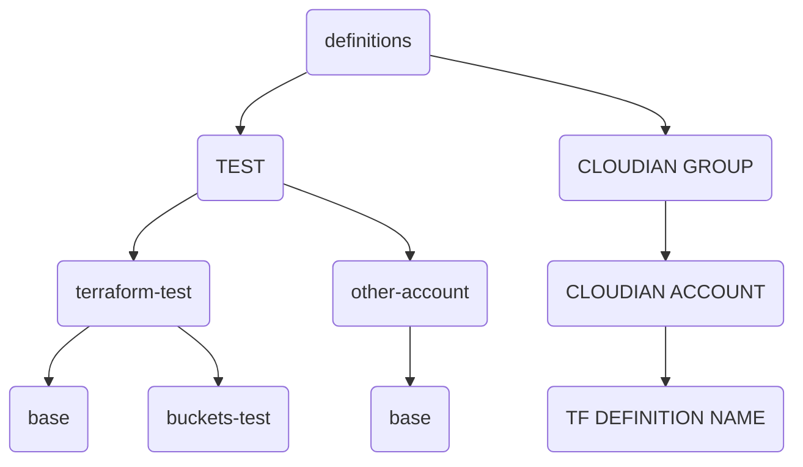
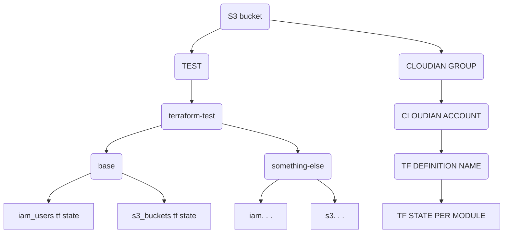

# Infrastructure Overview

## Deploying

NOTE: Currently you can only deploy locally. In the future Github actions will be the preferred way to deploy.

### Deploy with Github Actions

**TODO: Currently needs to be setup and tested**

### Deploy locally 

**1. Install Terraform and Terragrunt** 

Alternatively executables for other distros, Windows and Mac can be found online
```sh
sudo apt install terraform terragrunt
```

**2. Clone repository**
```sh
git clone git@github.com:arkivverket/****.git
```

**3. Export required variables**
```sh
# Can be found in Vault under: operations/terraform/infra-vault
# NOTE: in the future there will be multiple credentials per specific project
export AWS_ACCESS_KEY_ID=
export AWS_SECRET_ACCESS_KEY=

# Can be found by logging in as admin on Vault web UI
# NOTE: this process will change in future due security reasons
export VAULT_TOKEN=
```

**4. Navigate to Terraform definition you want to deploy**

Example: `definitions/TEST/terraform-test/base/`


**5. Run Terragrunt stack `plan` and `apply`**

These commands are equivalent to Terraform's `plan` and `apply`. In addition, Terragrunt automatically runs `terraform init`, no manual initialization is required.
```sh
terragrunt stack run plan
terragrunt stack run apply
```


## Directory structure
Simple and scalable directory structure for Terraform / Terragrunt deployments. 


**Overview of directory structure**

| Level | Directory      | Description                                                                                                                                           |
| ----- | -------------- | ----------------------------------------------------------------------------------------------------------------------------------------------------- |
| 1     | definitions    | Main directory where all deployments are defined                                                                                                      |
| 2     | TEST           | `Cloudian group`, directory name directly corresponds to actual group name                                                                            |
| 3     | terraform-test | `Cloudian account`, directory name directly corresponds to actual account name                                                                        |
| 4     | base           | Name of a `Terraform Definition`, directory name can be anything. Could be based on a project name, etc. There can be unlimited amount of definitions |

Each `Terraform Definition` folder requires two files.

| File name            | Description                                                                                                |
| -------------------- | ---------------------------------------------------------------------------------------------------------- |
| env.hcl              | Includes a list of IAM users and/or S3 buckets to be deployed                                              |
| terragrunt.stack.hcl | Defines which modules need to be fetched from a catalog repository to deploy entities defined in `env.hcl` |

Such a folder hierarchy is scalable while maintaining clarity of whats being deployed under particular `Cloudian Group` and `Cloudian Account`. Check out examples sections for detailed examples of `env.hcl` and `terragrunt.stack.hcl`.

## Terragrunt in-depth explanation
Terragrunt is a Terraform wrapper with a lot of useful feature additions. Terragrunt is heavily used in this repository due to the useful automations it provides. Terragrunt Docs: https://terragrunt.gruntwork.io/docs/

### root.hcl
One of the core features Terragrunt offers is the `root.hcl` file / template. This file can be found under `definitions/root.hcl`. Every deployment defined in this repository uses `root.hcl` as template to automatically generate `providers.tf` and `backend.tf`. Normally in Terraform you would have to define these files manually. Terragrunt allows us to define these files once in `root.hcl` with variables to generate `providers.tf` and `backend.tf` on demand based on particular deployment specifications.

**Let's inspect most important and interesting parts of `root.hcl`** 


```sh
# root.hcl - line: 4
environment_vars = read_terragrunt_config(find_in_parent_folders("env.hcl"))
```
Locates `env.hcl` and fetches variables for `Cloudian group` and `Cloudian account`. There is an `env.hcl` file for every deployment with different Cloudian group and account.

```sh
# root.hcl - line: 16
path = "iam/cloudian/${local.cloudian_group}/${local.cloudian_account}/cu"
```
This is a path in Vault to credentials Terraform uses to execute Terraform / Terragrunt code. It uses the fetched variables from `env.hcl` to define a path in Hashicorp Vault.

```sh
# root.hcl - line: 44
key = "operations-s3/${path_relative_to_include()}/terraform.tfstate"
```
This is the path to the S3 bucket where Terraform state files are stored. Variable / function `${path_relative_to_include()}` returns path a between `terragrunt.stack.hcl` and `root.hcl` files. For example, if `terragrunt.stack.hcl` is located in `definitions/TEST/terraform-test/base/`. The variable will insert a path: `TEST/terraform-test/base`. This results in the exact same folder layout for Terraform states location in S3 bucket as the layout in this repository. This is important because we create and store Terraform state per module. If that makes no sense at all, the next section explains how Terraform states are stored in more detail.

### Terraform state(s)
Usually Terraform state includes everything that is being deployed, mostly because that's easier to maintain. In Terraform, `backend.tf` and `providers.tf` have to be manually defined for each Terraform state. With Terragrunt these files are generated automatically, this means we can easily achieve Terraform state per module. 

Currently `iam_users` and `s3_buckets` modules have their own Terraform state organized and stored in S3 bucket. The folder hierarchy for Terraform states is exactly the same as the directory structure in this repository. Terraform state per module greatly reduces blast radius of something going wrong, any possible errors only affect deployment of one particular module. It isolates any potential damage done to the rest of infrastructure. It also means deploying is extremely fast, because the state is so small and specific. Having Terraform state per module would be a nightmare using regular Terraform, but since everything happens automatically, no manual interaction is required to achieve this. 

**Graph for easier visualization of how this actually looks inside of S3 bucket**

### Terragrunt Units and Stacks
Terragrunt units can be seen as Terraform modules with the ability to add Terragrunt based features. 

#### Example of s3_buckets unit
```hcl
include "root" {
  # Import root terragrunt file to generate terraform backend and provider files
  path = find_in_parent_folders("root.hcl")
}

terraform {
  source = "git::git@github.com:arkivverket/****.git//modules/s3_buckets?ref=${values.version}"
}

inputs = {
  buckets = values.buckets
}
```
Source: https://github.com/arkivverket/****/tree/master/units/s3_buckets

**Breakdown of s3_buckets unit**

| Code block | Description                                                                                                                                           |
| ---------- | ----------------------------------------------------------------------------------------------------------------------------------------------------- |
| include    | Defines where to find `root.hcl`                                                                                                                      |
| terraform  | Defines where to find the module                                                                                                                     |
| inputs     | Defines which values should be passed down to this unit. <br>In this example `buckets` and `version` values are defined that unit expects to receive |

Terragrunt units can be deployed as is, instead of defining values as variables. These values can be defined directly in the unit file. In this case, values are defined as variables because we are using Terragrunt stacks to deploy units.

#### Example of Terragrunt stack
```hcl
locals {  # Automatically load environment variables
  environment_vars = read_terragrunt_config("./env.hcl")
}

unit "iam_users" {
  source = "git::git@github.com:arkivverket/****.git//units/iam_users"
  path   = "iam_users"

  values = {
    version          = "master"
    users            = local.environment_vars.locals.iam_users
    cloudian_group   = local.environment_vars.locals.cloudian_group
    cloudian_account = local.environment_vars.locals.cloudian_account
    iam_path         = "/terraform/repo/plattform-lagring-s3/definitions/${basename(get_terragrunt_dir())}/"
  }
}

unit "s3_buckets" {
  source = "git::git@github.com:arkivverket/****.git//units/s3_buckets"
  path   = "s3_buckets"

  values = {
    version          = "master"
    buckets          = local.environment_vars.locals.buckets
  }
}
```

**Breakdown of terragrunt stack**

| Inputs | Description                                                                                                               |
| ------ | ------------------------------------------------------------------------------------------------------------------------- |
| source | Points to path where unit is located, in this case catalog repository                                                     |
| path   | Name of directory unit will be downloaded to. Useful when deploying same unit more than once in the same stack definition |
| values | Corresponds to the `values` defined in unit file                                                                          |

In this example we're importing `env.hcl`, fetching and passing down values to units. This is the same `env.hcl` file that is also used by `root.hcl` to fetch `Cloudian group` and `Cloudian account`. 

When the Terragrunt stack definition is deployed it runs two different Terraform instances in parallel. This means when `terragrunt stack run plan` is executed, it runs `terraform init` and `terraform plan` for each of the units at the same time. We can do this because each unit has its own Terraform state. It is also possible to define dependencies and pass outputs between units if required.

### Terragrunt abstractions
Terragrunt is just a Terraform wrapper, Terraform is still the backbone of each Terragrunt unit and stack. It only abstracts Terraform code so we can focus on the most important details. When Terragrunt runs, it generates a file structure which Terraform can understand and execute. 

Here's an example of what Terragrunt generates to better understand what is happening in the background.

**TODO: Example of file structure generated by Terragrunt**

### Catalog of modules and units

**TODO: Quick summary of modules and units catalog**


### Deployment examples

**TODO: Create some examples with a good overview**


**Additional useful sources**
- https://terragrunt.gruntwork.io/docs/features/stacks/
- https://www.gruntwork.io/blog/the-road-to-terragrunt-1-0-stacks